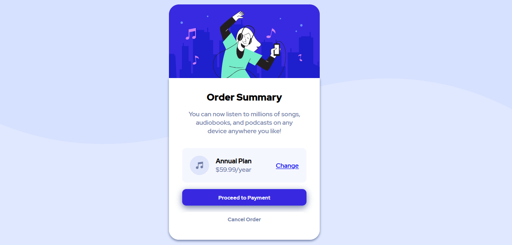

# Frontend Mentor - Order summary card solution

This is a solution to the [Order summary card challenge on Frontend Mentor](https://www.frontendmentor.io/challenges/order-summary-component-QlPmajDUj). Frontend Mentor challenges help you improve your coding skills by building realistic projects. 

## Table of contents

- [Overview](#overview)
  - [The challenge](#the-challenge)
  - [Screenshot](#screenshot)
  - [Links](#links)
- [My process](#my-process)
  - [Built with](#built-with)
  - [What I learned](#what-i-learned)
  - [Continued development](#continued-development)
  - [Useful resources](#useful-resources)
- [Author](#author)

## Overview

### The challenge

Users should be able to:

- See hover states for interactive elements

### Screenshot

### Links

- Solution URL: [Github](https://github.com/OmKakatkar/order-summary-component)
- Live Site URL: [Hosted on Netlify](https://order-summary-component1.netlify.app/)

## My process

### Built with

- Semantic HTML5 markup
- CSS custom properties
- Flexbox

### What I learned

I learned about Mobile First Approach. I was able to practice flex box and CSS custom properties as well.

### Continued development

This was my first ever UI challenge on Frontend Mentor. It was a little rough at start. I would like to learn more about the best way to use flexbox. After looking at the designs, I can say that my solution might be having some extra height than the provided designs. Also I would like to explore more on the box shadow property.
### Useful resources

- [StackOverFlow](https://stackoverflow.com/questions/11447707/div-container-larger-than-image-inside) - There was a 5px gap between the image and its container. This link fixed my problem.
## Author

- Website - [Om Kakatkar](https://omkakatkar-portfolio.netlify.app/)
- Frontend Mentor - [@OmKakatkar](https://www.frontendmentor.io/profile/OmKakatkar)
- Twitter - [@omkakatkar](https://twitter.com/omkakatkar)